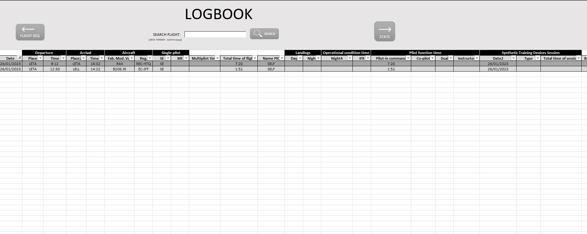

## Pilot's Logbook

This is a personal project based on the development of a [pilot's logbook](https://en.wikipedia.org/wiki/Pilot_logbook) using VBA coding to use a Microsoft Excel interface.
The aim of this project is providing to pilots a simple and intuitive tool to fill up their flights registers in a faster way. 
Also the spreadsheet allows checking the flown hoursfor different scenarios and conditions.

## Description

The Logbook is divided in three spreadsheets: Register, Logbook and Statistics

  

- Register: Is the
- Logbook: Is the logbook itself, where all the registers are stored ordered by date. A searching tool allows checking all the flight logs entered in a specific date.
- Statistics: In this spreadsheet the pilot can check the total flight and simulation hours for different categories.

# Categories
| Flight Type | Description
|-------------|---------------|
| LCI | Firefighting |
| AOC | Company regular flights |
| SPO | Special Purpose Ops. |
| ATO | Flight school |
| ER/VC | Maintenance |

| Operational condition | Description
|-------------|---------------|
| Night | Flying at night |
| IFR | Flying under instrumental rules |

| Single pilot | Description
|-------------|---------------|
| SE | Single engine |
| ME | Muliple engine |

> NOTE: This project has been developed using the spanish pilot's flight logbook as reference. Some acronyms may differ from other states.
